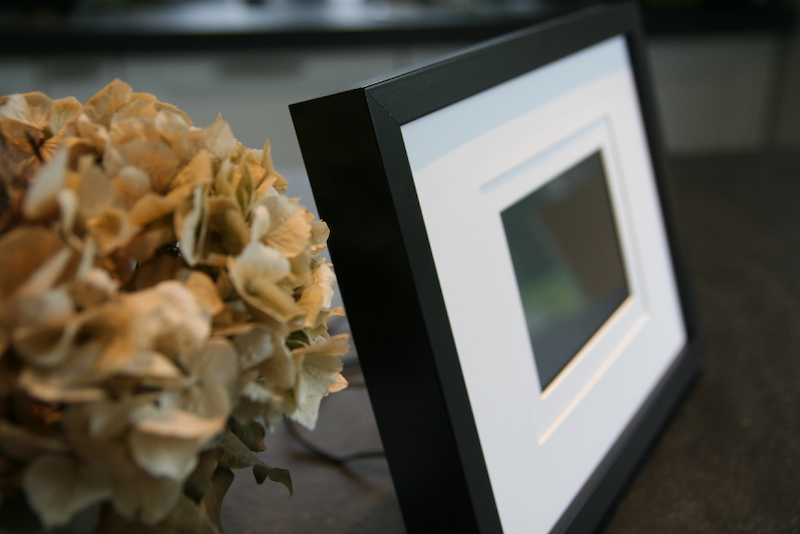
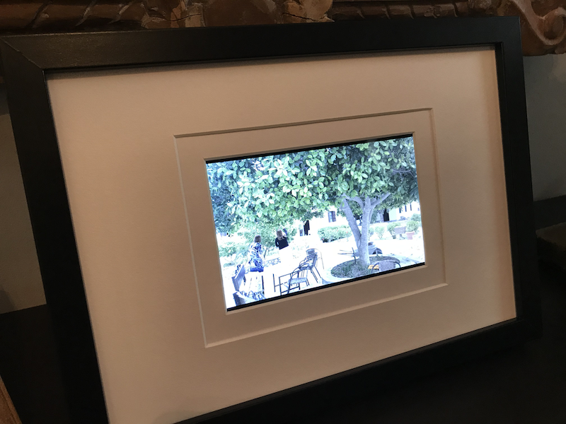
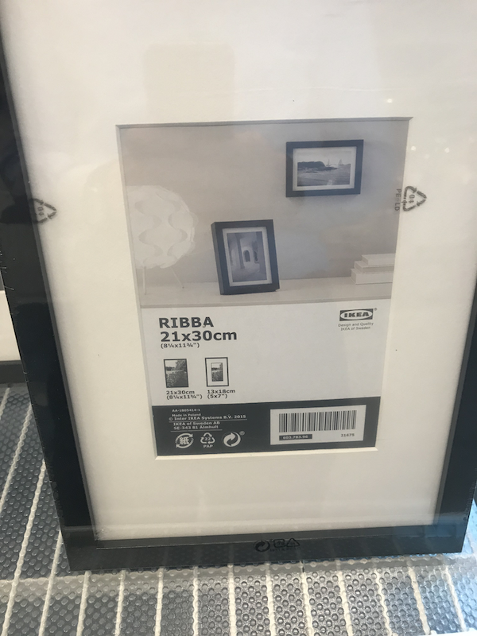
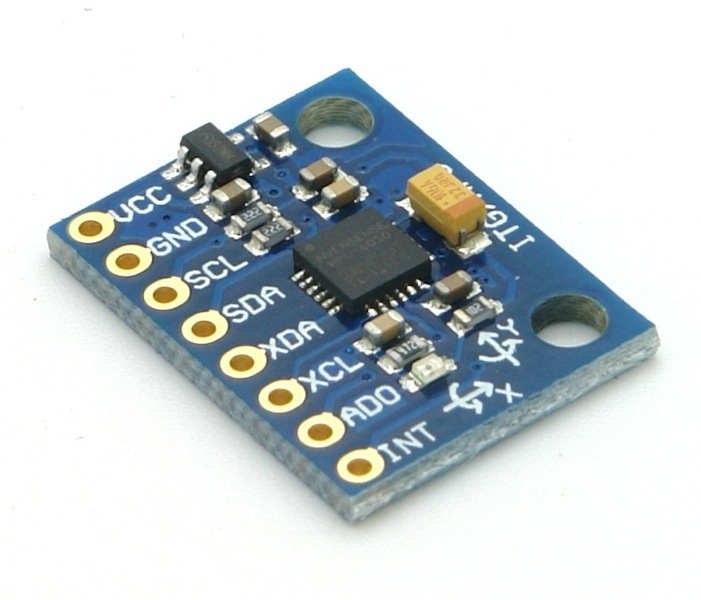

[](https://travis-ci.org/paulknewton/pi-cloud-frame)
[](https://codecov.io/gh/paulknewton/pi-cloud-frame)

[](https://deepsource.io/gh/paulknewton/pi-cloud-frame/?ref=repository-badge)
# pi cloud frame


An icloud-powered digital frame running on a Raspberry Pi.
Downloads a random sample of photos from your icloud account, crops them to the correct aspect ratio and displays them. Supports parallel slideshows, interactive menus, GPS/EXIF lookup and auto rotation via a MPU-6050 accelerometer.

## What is it?

Like most people, I have a digital photo frame at home.
In my case, a beautiful Nixplay display that includes lots of fancy cloud integration.
Photos can be uploaded remotely and synchronised from various sources. It even has its own email address!

I am really happy with this frame. The display quality is excellent and for the most part, I haven't had any issues with it.

But there are a few things that I really miss:
* no icloud support - all of my photos are stored in the Apple icloud, but the only way to sync photos to Nixplay is to copy them to some other supported platform like Dropbox.

* no auto-cropping - the frame uses 16:9 aspect ratio while most of my photos are 3:2. I have to manually crop these to get them to fit the frame.

* no automatic syncing of new photos - all photos need to be manually pushed to the digital frame. This means more manual effort for adding new photos. Uploading the many 1000s of photos I have accumulated over the years is pretty much out of the question. (UDPATE: Nixplay now support [Dynamic Playlists](https://blog.nixplay.com/2018/10/nixplays-dynamic-playlists-explained) from Google Photos and Dropbox)

All of this means that it becomes a bit of a pain to add photos to my photo frame.
I end up leaving the same set of photos on endless rotation like some old MTV playlist, and all my other photos sit on a remote disk somewhere, gathering digital dust.

This python project tries to solve all of these problems and help to unlock my 1000s of digital photos.
It downloads a random sample of photos from an icloud album and automatically crops these to the correct aspect ratio (based on the target photo frame).
The photos are then automatically transferred to the photo frame - either to a Nixplay frame via Dropbox or stored locally in a folder for display by the pi-cloud-frame (running on a Raspberry Pi).

The photo display software runs on a Raspberry Pi connected to an official Pi display (although it could run on anything). The software supports simple photo slideshows but also lots of extras like:

* 'Stacked' photo viewers to allow multiple slideshows to be setup in parallel. The user can jump between slideshows at any time by touching the screen.
* Embedded custom widgets (currently I have a system dashboard, but others are in the pipeline such as a video player)
* Auto-detect frame orientation and skip non-matching photos (landscape/portrait)
* Interactively delete unwanted photos
* Show meta-information about each photo (date, filename and lookup of locations from GPS data)

The download software can be used independently from the photo viewer, and I run this on any old Linux box. The photo display software runs on a Raspberry Pi attached to one of the official displays and packaged into a frame enclosure.

## The final results: Pi Cloud Frame

Let's look at the final result before we go into any details: the Pi Cloud Frame:



And here it is in action:



## Installing the code

The main code to download photos is written in python, using the [pyicloud](https://github.com/picklepete/pyicloud) library. This library provides a clean API to access the iCloud and download photos (or anything else actually). The current version does not support the latest 2-phase authentication introduced by Apple, so you will need to [use this patched version instead](https://github.com/PeterHedley94/pyicloud).

Start by installing the patched ```pyicloud``` library using ```pip``` (if you are not using virtualenv then you will probably need to run this as super-user via ```sudo```):

```
pip install git+https://github.com/PeterHedley94/pyicloud
```

The photo viewing software is written in PyQt (v5). If you are trying to install this on a Raspberry Pi, it will fail if you try to install via ```pip```. So instead install the PyQt libraries first using the ```apt``` package manager:

```
sudo apt-get install python3-pyqt
```


The rest of the python dependencies are all listed in ```requirements.txt``` so installation should be a matter of:

```
pip install -r requirements.txt
```

Finally, the image cropping (to adapt to different photo frame formats) is done using the ```imagemagick``` libraries. I tried to do this in python with ```PIL/Pillow``` but these do not have support for the .HEIC image format, so you will need to install the ```imagemagick``` tools separately. On the Raspberry Pi, this can also be done via ```apt``` (other platforms can use their specific package managers e.g. ```homebrew```):

```
sudo apt install imagemagick
```

## Running the code

The code has 2 main programs:
* ```bin/refresh_photos```: a shell script to download the photos from the iCloud, crop to the correct aspect, adjust the rotation flags, and send the results to the correct output folder
* ```frame.py```: the PyQt application to display the photos on the Raspberry Pi.

You can use both of the tools, or just one. For example, if you have a nice Nixplay frame then you will only need the downloader. If you don't use iCloud and have your photos stored locally, then you will only need the photo viewer (but you will need to re-crop the photos to match the display).

### Downloading the photos

Just run the ```refresh_photos``` script with the relevant parameters from the root directory:

```
./bin/refresh_photos icloud_id icloud_pwd frame_profile icloud_album num_photos
```
where:
* ```icloud_id``` - your apple ID
* ```icloud_pwd``` - your apple password
* ```frame_profile``` - a custom profile for your digital photo frame (I've added some sample ones already)
* ```icloud_album``` - the icloud album to use as the source of the photos
* ```num_photos``` - the number of photos to download (or less if the album does not have enough photos)

The script uses a frame profile which is just a bunch of pre-defined settings for your specific photo frame. You will likely need to edit these yourself. Open ```bin/refresh_photos``` and jump to the section marked ```### EDIT THIS SECTION TO ADD YOUR PHOTO FRAME ###```. Add a new photo frame (or edit an existing one. You must set:
* ```DOWNLOAD```: the folder to temporarily store photos as they are downloaded
* ```CROPPED```: the folder to temporarily store the photos once they are cropped for your frame
* ```OUT```: the folder to store the final photos ready for display
* ```ASPECT```: the aspect ratio of your frame used when cropping the photos (important! 16:9 is a landscape ratio, while 9:16 is the equivalent portrait ratio. Make sure you get them the right way round).
* ```ORIENTATION```: if your frame is landscape or portrait

A special note on the ```OUT``` parameter. This is where the final photos will be stored. If you are using a Nixplay frame then you will likely want this to be a Dropbox folder that will automatically upload the photos to your Dropbox account where the Nixplay frame can sync them (I won't go into more details about setting up Dropbox playlists on a Nixplay. Jut google it for more info). If your photo is a Raspberry Pi running the photo display software then this will be a local folder on the Pi. We will include this folder later when configuring the Pi viewer.

Start the ```refresh_photos``` script with the correct arguments. If this is the first time you are running it you will be asked to authenticate yourself to the iCloud. This uses the familiar Apple 2-phase authentication process where you need to enter your mobile number and you will be sent a 1-time-use code. Enter this here and the process should continue. The photos from the album are queried for ones matching your frame (landscape/portrait). A random sample is then chosen up to the maximum number specified and the downloading begins. Once the photos are downloaded they will be cropped/rotated using the ```convert``` tool from the ```imagemagick``` suite. The cropped photos are saved in the output photo, and any temporary photos are cleaned up.

For reference, the main python script is ```icloud_photos.py``` which takes a series of arguments as follows:
```
usage: icloud_photos.py [-h] [--output OUTPUT] [--sample SAMPLE]
                        [--album ALBUM] [--orientation {portrait,landscape}]
                        user password

icloud photo frame

positional arguments:
  user                  icloud user
  password              password

optional arguments:
  -h, --help            show this help message and exit
  --output OUTPUT       folder to store downloaded photos
  --sample SAMPLE       number of photos to download
  --album ALBUM         icloud album to find photos
  --orientation {portrait,landscape}
                        orientation of photos
```

### Displaying the photos

The photo frame display is written as a Qt5 application. The program needs to be configured in ```config.yml``` to setup the list of media players. A sample file is included in ```config_sample.yml```:

```
frame:
    slideshow_delay: 30000
    root_folder: media
    font: 14
    compass: mpu6050
    flip_rotation: true

players:
   Holiday Photo Player:
        type: photo_player
        folder: italy
		shuffle: true
        
    Family Photo Player:
        type: photo_player
        folder: personal
		shuffle: false
        
    My dashboard:
        type: dashboard
```
 The configuration consists of 2 parts:

* ```frame```: generic parameters for the frame as a whole (not specific to each player)
* ```players```: a list of players. These can be photo viewers - each with their own folder of photos. They could be other player types such as a system dashboard that shows the state of the photo frame (other media players are planned, e.g. a video player).

The following ```frame``` parameters are supported:

* ```slideshow_delay```: delay (in ms) between each update
* ```root_folder```: main root folder containing the photos (can have sub-folders per player under this directory)
* ```font```: font size used for the popup menu
* ```compass```: indicates if the frame auto-detects the physical orientation of the frame so the photos can be automatically rotated. 2 compass types are supported: ```fixed``` (a hard-coded compass) or ```mpu6050``` (a popular accelerometer)
* ```rotation```: only used by the ```fixed``` compass. Defines the rotation of the frame (90, 180, 270 etc).
* ```flip_rotation```: if the angle reported by the compass should be inverted (useful for an MPU-6050 sensor that is installed back-to-front...yes, like mine). Values: ```true``` or ```false```.

Each player has a ```type```. Currently, this can be:
* ```photo_player```: a photo viewer. Supports slideshows of photos in a folder.
* ```dashboard```: a system dashboard that shows information about the photo frame (settings, list of players, numbers of photos)
* ```video_player```: not currently implemented. Placeholder for a future player

The remaining attributes depend on the type of player:
* ```photo_player```
  * ```folder```: the location (under ```root_folder```) of the photos/videos.
  * ```shuffle```: if the photos should be shuffle (```true```) or played in sequence (```false```)
* ```video_player``` - same as ```photo_player```
* ```dashboard```
  * None

Once the photo frame has been configured, run it by typing:
```
./frame.py
```

and the main window should open with the splash screen:


One last step: if you want to launch the viewer via the touchscreen, there is a desktop shortcut for the Pi. Copy ```frame.desktop``` to your ```Desktop``` folder (or create a symbolic link). Then just double-click on the icon and it will prompt you to run the frame software.

## Using the viewer

* Next / Previous Photo (Right/Left Tap or Right/Left Keys)
	The runs the first player in the ```players``` section. Photo players allow users to navigate between photos at any time by clicking on the right-hand side of the screen, or jump back to the previous photo by clicking on the left-hand side. The right/left arrows on a keyboard also work.
* Next / Previous Player (Top/Bottom Tap or Up/Down Keys)
	If the user clicks on the top or bottom parts of the screen, it jumps to the previous/next media player (if any are configured). In the example above, it would switch from the ```Holiday Photo Player``` to the ```Family Photo Player```. This allows multiple slide shows to be running in parallel. The up/down arrows on a keyboard also work.
* Popup Menu (Centre Tap or Enter/Return Keys)
	If the user taps the centre area, a popup window appears showing the filename, date and location information (if available). It also allows the user to delete a photo from the device (if, like me, you have some photos that you just do not recognise and wonder how they made it into your collection!). The Enter/Return keys on a keyboard also work.

## Making the frame

If you want to make a pi cloud frame like the one in the picture above, this is how I went about it.

The heart of the frame is a [Raspberry Pi 3+ Model A](https://www.raspberrypi.org/products/raspberry-pi-3-model-a-plus/) (I went for the Model A over the Model B because it is smaller and uses less power. And yes, cheaper as well!).


The Pi is mounted on to the [official Raspberry Pi display](https://www.raspberrypi.org/products/raspberry-pi-touch-display) and responds to touches on the touchscreen for navigating back/forwards, bringing up popup menus or changing the slideshow (see above). I did look at other display options: an old monitor from eBay, or maybe some other Pi-compatible display. But really, I would stick with the official display - it is well-made, reasonably priced, supportes touchscreen, and...it just works.


Once the Pi was hooked up to the screen, I squeezed it all inside an [Ikea](https://www.ikea.com) photo frame. I actually bought a few different frame sizes at the same time. I only used the largest frame, but the other cardboard covers came in handy to place over the display and hide the edges. The Ikea frames are cheap and just about thick enough to accomodate a Pi display with a Pi stuck on the back. I had to offset the Pi on the back of the display and flip it over so the GPIO pins did not bend against the frame back. You can experiment to get it to fit.



The hardest part was preventing the Pi from sliding around inside the frame. I envisaged all kinds of complex fixings, but in the end grabbed a cardboard box from a well-known e-commerce company and made a bunch of wedges around the sides. So far, it works like a charm.


Before sealing up the frame, you may want to install an acclerometer like this MPU-6050:



These only cost a few euros and allow the frame to detect which way up it is. The photo display software uses this to automatically rotate the photos.

And finally...seal up the frame with some masking tape on the back to stop everything falling out. And we are ready to go.

## Sending the frame to sleep
I have the frame working all day, cycling from 1 photo to the next. During the nighttime I switch off the display (but the Pi keeps running) via the ```display``` command:

```
./bin/display off
```

You can schedule this with a simple ```cron``` job (off at midnight, back on at 06h30 the next day):

```
# switch off display at night
0 0 * * * /home/pi/pi-cloud-frame/bin/display off

# switch on display in the morning
30 6 * * * /home/pi/pi-cloud-frame/bin/display on
```

And that's it. Hope you start re-discovering all of your old photos. I certainly did!
